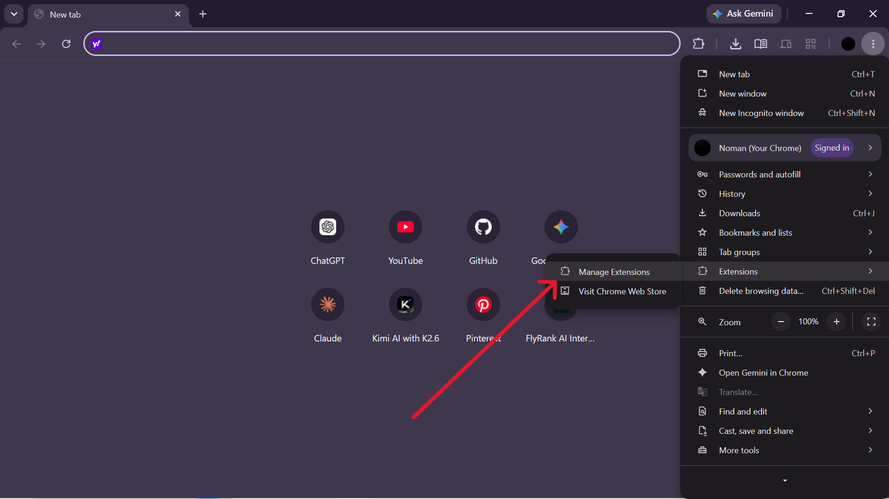
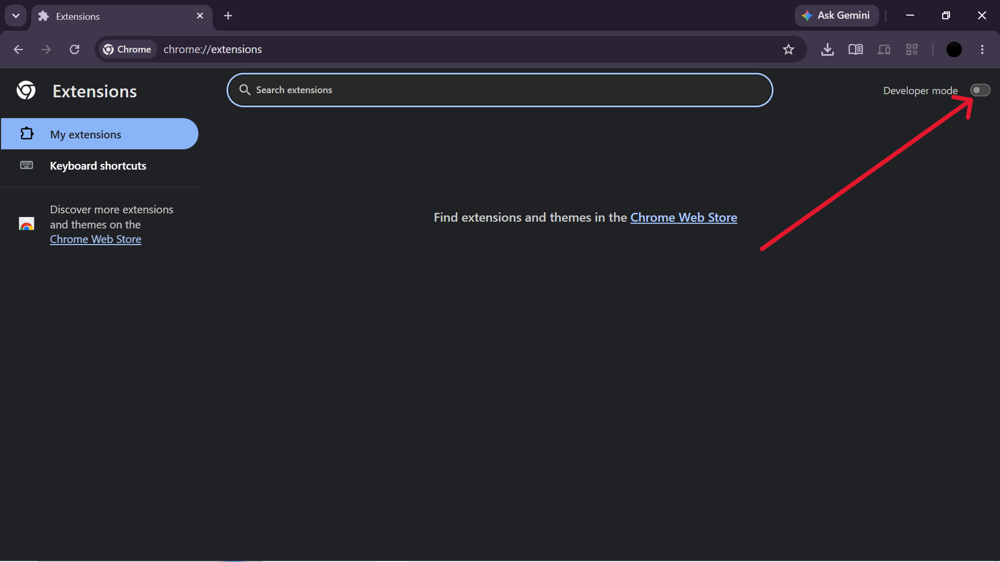
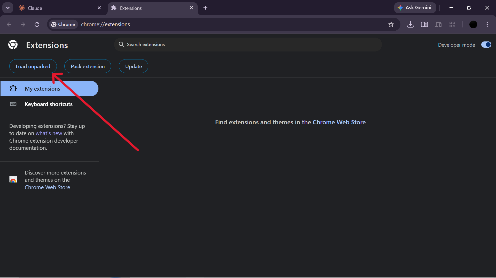
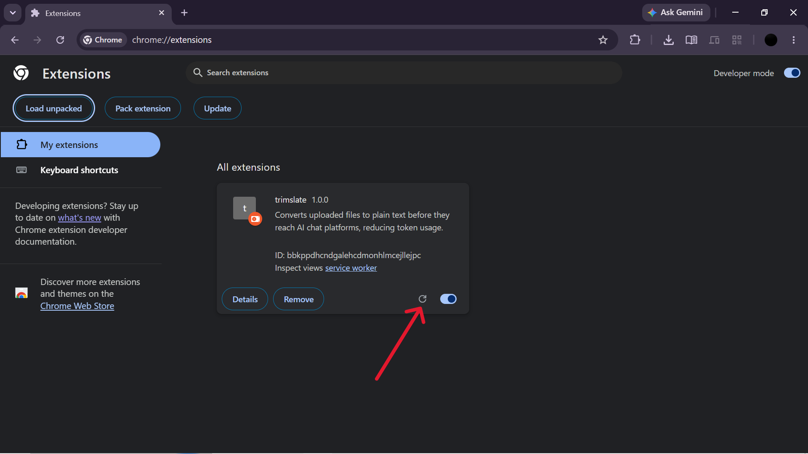

<div align="center">

<br/>

```
               ████████╗██████╗ ██╗███╗   ███╗███████╗██╗      █████╗ ████████╗███████╗
                  ██╔══╝██╔══██╗██║████╗ ████║██╔════╝██║     ██╔══██╗╚══██╔══╝██╔════╝
                  ██║   ██████╔╝██║██╔████╔██║███████╗██║     ███████║   ██║   █████╗  
                  ██║   ██╔══██╗██║██║╚██╔╝██║╚════██║██║     ██╔══██║   ██║   ██╔══╝  
                  ██║   ██║  ██║██║██║ ╚═╝ ██║███████║███████╗██║  ██║   ██║   ███████╗
                  ╚═╝   ╚═╝  ╚═╝╚═╝╚═╝     ╚═╝╚══════╝╚══════╝╚═╝  ╚═╝   ╚═╝   ╚══════╝
```

**Stop Burning Claude Tokens.**

trimslate quietly converts PDFs, Word docs, spreadsheets, and slides into clean plain text
*before* they ever reach Claude — so your context window holds more conversation and less file overhead.

<br/>

[](https://developer.chrome.com/docs/extensions/mv3/)
[](#-privacy--security)
[](#-in-progress)
[](LICENSE)

<br/>

### Uploading a PDF natively costs ~5× more tokens than plain text — trimslate fixes that.

<br/>

| File | Native upload | After trimslate | Saved |
|---|---|---|---|
| 10-page report | ~15,000 tokens | ~3,000 tokens | **80%** |
| 20-page academic paper | ~30,000 tokens | ~7,000 tokens | **75%** |
| Technical doc with tables | ~25,000 tokens | ~6,000 tokens | **76%** |
| Dense code/reference doc | ~20,000 tokens | ~8,000 tokens | **60%** |

> **Why so much?** Claude processes uploaded PDFs as images — every page is vision-tokenized at ~1,500–2,000 tokens regardless of content. The same page as plain text costs ~300–400 tokens. trimslate converts locally and injects text, so Claude never sees the file at all.

<br/>

</div>

---

## ⚡ The Problem

When you upload a PDF or Word doc to an AI chat, the platform tokenizes everything — bloated formatting, embedded metadata, repeated headers and footers, structural noise — all of it eats into your context budget before a single word of your prompt is even read.

**trimslate sits between your file and Claude.** The moment you drop or pick a file, trimslate intercepts it, converts it to lean plain text locally in your browser, strips out repetitive junk, and hands Claude exactly what it needs — nothing more.

---

## ✨ Features

| | Feature | Detail |
|---|---|---|
| ⚡ | **Automatic interception** | Catches files the instant they're dropped or selected on claude.ai, before the platform ever sees the original |
| 📄 | **Broad format support** | PDF, DOCX, XLSX, PPTX, CSV, TXT, MD, JSON, HTML, XML |
| 🧹 | **Smart header/footer stripping** | Detects and removes repeated boilerplate across PDF pages |
| 📊 | **Live progress mini-bar** | Floating status indicator shows conversion progress and estimated token savings, never overlapping the input |
| 🛡️ | **Size-aware pass-through** | Files 30MB+ skip conversion and upload natively — nothing ever freezes your tab |
| 🔀 | **Chunked, non-blocking transfer** | Large files streamed internally so the extension stays responsive |
| 🔒 | **100% local processing** | Every conversion happens on your machine — no servers, no API keys, no accounts |

---

## 🛠 How It Works

```
content.js  --->  service-worker.js  --->  offscreen.js
(claude.ai)         (background)        (parses PDF/DOCX/etc)
     ^                                          |
     |______________ plain text injected _______|
```

1. **Content script** detects a file drop or picker selection on claude.ai and intercepts it before upload
2. **Background service worker** spins up a hidden offscreen document (required by Manifest V3 for DOM-dependent parsing)
3. **Offscreen document** runs the actual conversion using bundled [pdf.js](https://github.com/mozilla/pdf.js), [mammoth.js](https://github.com/mwilliamson/mammoth.js), and [SheetJS](https://github.com/SheetJS/sheetjs), then returns clean text
4. The resulting plain text is injected directly into the claude.ai message box, ready to send

---

## 📦 Installation

> trimslate isn't on the Chrome Web Store yet — install it directly from source in 4 steps.

<br/>

**Step 1 — Open the Chrome menu and go to Manage Extensions**



Click the three-dot menu (⋮) in the top-right corner of Chrome, then click **Manage Extensions**.

---

**Step 2 — Enable Developer mode**



On the Extensions page, toggle **Developer mode** on using the switch in the top-right corner. Chrome may show a safety prompt — that's expected for unpacked extensions not sourced from the Web Store.

---

**Step 3 — Load the extension**



Click **Load unpacked**, then navigate to and select the `trimslate` folder you cloned.

---

**Step 4 — Confirm it's running**



You'll see trimslate appear in your extensions list with its toggle enabled. The extension is now active on claude.ai.

---

**Clone the repo**

```bash
git clone https://github.com/NomanRafique01/Trimslate.git
```

Then follow the steps above.

> **Note:** Chrome requires Developer mode to stay on for unpacked extensions. To update, run `git pull` and hit the reload (↻) icon on the extensions page.

---

## 🗂 Supported File Types

| Format | Extension | How it's handled |
|---|---|---|
| PDF | `.pdf` | ✅ Converted — text extracted, headers/footers stripped |
| Word | `.docx` | ✅ Converted — formatting removed, clean text output |
| Excel | `.xlsx` | ✅ Converted — cell values extracted as plain text |
| PowerPoint | `.pptx` | ✅ Converted — slide text extracted in order |
| CSV | `.csv` | ➡️ Passed through natively |
| Plain text | `.txt` | ➡️ Passed through natively |
| Markdown | `.md` | ➡️ Passed through natively |
| HTML | `.html`, `.htm` | ✅ Converted — tags stripped, readable text only |
| JSON / XML | `.json`, `.xml` | ➡️ Passed through natively |

---

## 🚧 In Progress

- **Standalone popup converter** — a drag-and-drop popup for converting any PDF to `.txt` independent of claude.ai, with page-range selection and direct download. Currently scaffolded and in active development.
- **OCR support** — infrastructure for extracting text from scanned/image-based PDFs is being wired in.

---

## 🔒 Privacy & Security

- No network requests to any third party — ever
- No API keys, accounts, or sign-ups required
- All parsing libraries are bundled locally; nothing is fetched at runtime
- The extension runs only on `claude.ai`
- Your files never leave your browser except as plain text going into your own chat

---

## 🤝 Contributing

Issues and pull requests are welcome. If you run into a file that doesn't convert cleanly, open an issue with the file type and a minimal reproduction if possible.

---

## 📄 License

MIT — see [LICENSE](LICENSE) for details.

<div align="center">
<br/>
<sub>Built to stop wasting tokens on formatting noise.</sub>
</div>
```
